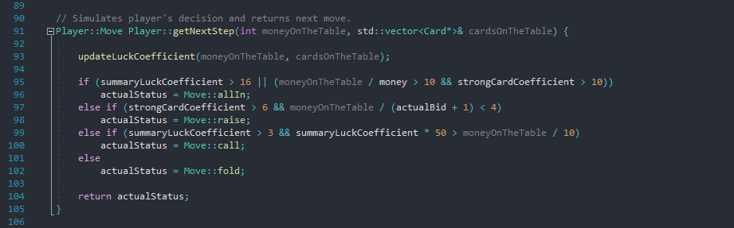

# Poker Texas Hold'em

> Try out Texas Hold'em poker - the most popular card game in the world. 
It is the game where every player has 2 private cards (all hidden) and up to 5 open cards on the table. 
The winner is the one who has the best card combination. 
You can choose the number of gamers from 2 to 9 but watch out - you are playing with the artificial inteligence - the computer. 
Remeber about your poker face too.

## How to play:
* in first step, you have to set number of players in answer to the question;
* play according to the tips which are comming up on the screen;
	
## Game has implemented:
* other players decisions depend on hand cards, money on the table, players money and luck;
* when turn is won by multiple players with the same hands' rank, the winner is a player with higher 
hand ranking card (for example two players have straight. Better straight is determined by the highest straight card);
* when multiple players have the same best cards, table money are divided;
* when won multiple players with all in, money are divided by percentage participation;
* variable amount of players <2, 9>;
* random start player and cyclic transition after next turn;
* small and big blind;

## Screenshots from the game:

## Simulation of virtual players' decisions:
Virtual players have simulated decisions based on algorithm in Player class. All of *summaryEfficient* component variable has random part.
Algorithm is placed below:

## To do (development ideas):
* add GUI with QT library;

## Contact
Created by Mateusz Łyszkiewicz  
mat.lyszkiewicz@gmail.com
